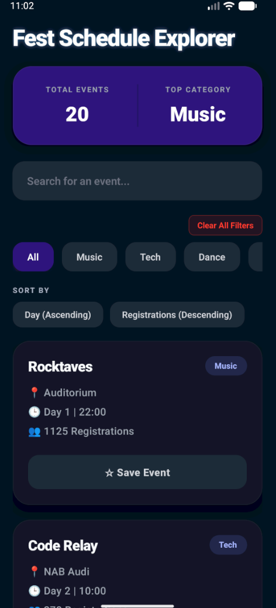

# 🚀 Apogee Events App

A sleek, responsive mobile dashboard built with **React Native (Expo)** and **TypeScript** to manage and explore events for the Apogee fest.

---

## 📸 Dashboard Preview
<div align="center">
  
  <p><i>The central hub for all Apogee fest activities.</i></p>
</div>

---

## 🛠️ Project Reflection

### 1. What features did you implement in this task, and what were you unable to complete?

**Features Implemented:**
* **Live Search:** Instant filtering of events by name using React state.
* **Category Chips:** Quick-filter system for different event types.
* **Dynamic Stats:** Auto-calculates the "Most Popular Category" using registration data.
* **Smart Sorting:** Toggle to view trending events based on registration count.
* **Interactive Cards:** Independent "Save" states for each event with visual feedback.
* **Safe UI:** Optimized layout using `SafeAreaView` to handle notches and home indicators.

**What I was unable to complete:**
* **Glassmorphism:** I intended to add frosted-glass visual effects but prioritized core logic first.
* **Theme Toggle:** I wanted to include a Dark/Light mode button but couldn't implement it in this version.

---

### 2. How did working with React Native in Part 2 feel different from Vanilla JavaScript?

* **Component-Based Native UI:** Instead of using HTML tags like `<div>` or `<h1>`, I used Native components like `<View>` and `<Text>`. This allowed me to build reusable UI units that translate directly to native Android and iOS elements.
* **Declarative Data Flow:** In Vanilla JS, I would have to manually "find" elements in the DOM to update them. In React Native, I simply manage the state, and the framework handles the data flow to the native bridge, updating the mobile UI automatically.

---

### 3. What did you learn from this task?

* **Expo Efficiency:** Learned how easy it is to bootstrap a project and preview it instantly on a device.
* **TypeScript Safety:** Gained experience using types to ensure code reliability and catch errors early.
* **Mobile Design:** Learned the basics of professional mobile dashboard structure and asset management.

---

## 📂 Project Structure
```text
app/
 ┗ 📂 (tabs)/          # Main dashboard screens
src/
 ┣ 📂 components/      # Reusable UI units
 ┣ 📂 data/            # Event data store
 ┣ 📂 types/           # TypeScript interfaces
 ┗ 📂 assets/images/   # Project imagery (dashboard-mockup.png)
